# Project-2

## Contents
* [Introduction](#Introduction)
* [Design](#Design)
    * [Risk Assessment](#Risk-Assessment)
    * [Trello Board](#Trello-Board)
    * [Architecture Diagram](#Application-Diagram)
    * [CI Pipeline](#CI-Pipeline)
* [Development](#Development)
    * [Front End](#Front-End)
    * [Testing](#Testing)
* [Conclusion](#Conclusion)

---
## __Introduction__

The objective of this project is to create service-orientated architecture for your application, this application must be composed of at least 4 services that work together. More specifically, one service that acts as a front-end wrapper service, two back-end services, and a final service that depends on the data from the other 2 back-end services.

This project aims to incorporate the tools, methodologies and technologies covered during training which include:

* Kanban Board: Asana or an equivalent Kanban Board
* Version Control: Git
* CI Server: Jenkins
* Configuration Management: Ansible
* Cloud server: GCP virtual machines
* Containerisation: Docker
* Orchestration Tool: Docker Swarm
* Reverse Proxy: NGINX

To satisfy the MVP the project must inlude the following:

* An Asana board (or equivalent Kanban board tech) with full expansion on tasks needed to complete the project.
* This could also provide a record of any issues or risks that you faced creating your project.
* An Application fully integrated using the Feature-Branch model into a Version Control System which will subsequently be built through a CI server and deployed to a * * cloud-based virtual machine.
* If a change is made to a code base, then Webhooks should be used so that Jenkins recreates and redeploys the changed application
* The project must follow the Service-oriented architecture that has been asked for.
* The project must be deployed using containerisation and an orchestration tool.
* As part of the project, you need to create an Ansible Playbook that will provision the environment that your application needs to run.
* The project must make use of a reverse proxy to make your application accessible to the user.

## __Design__

### __Risk Assessment__
A risk assessment for the project was preformed in order to mitigate any potential risks that may occur during the project.

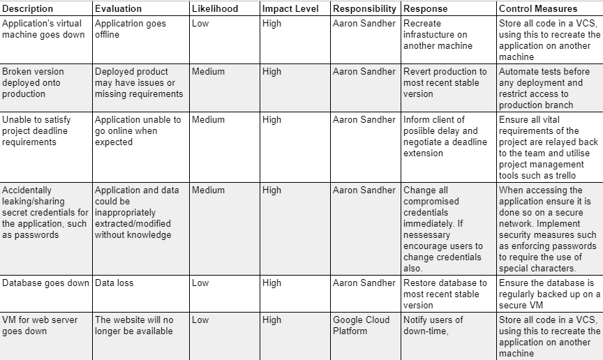

### __Trello Board__
A Trello board was used to organise, prioritize and monitor tasks of the project.

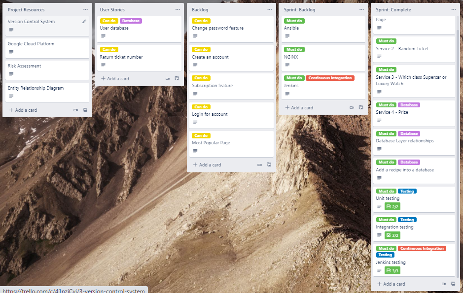

### __Architecture Diagram__

Below is a outline for the application:

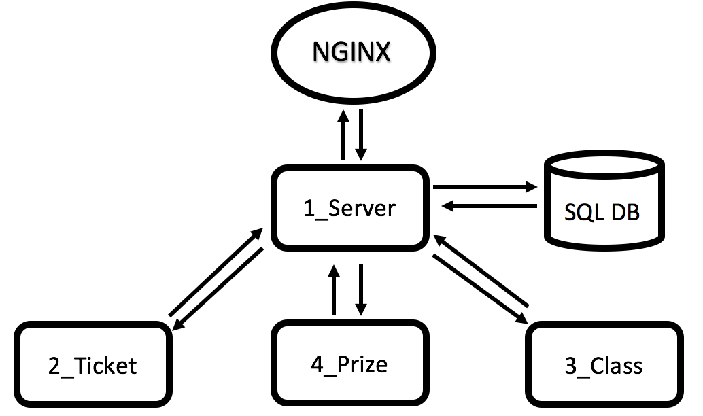

#### Pryze Raffle
* Service 1 (front-end): displays the results of the following 3 services for the user to see, as well as a brief history of past results and allows user to enter their name
* Service 2: returns a random ticket number
* Service 3: returns a class of prizes depending on the name uput from front-end
* Service 4: returns a randon prize 

---
### __CI Pipeline__

The diagram below oultines the CI pipe intended for the application.

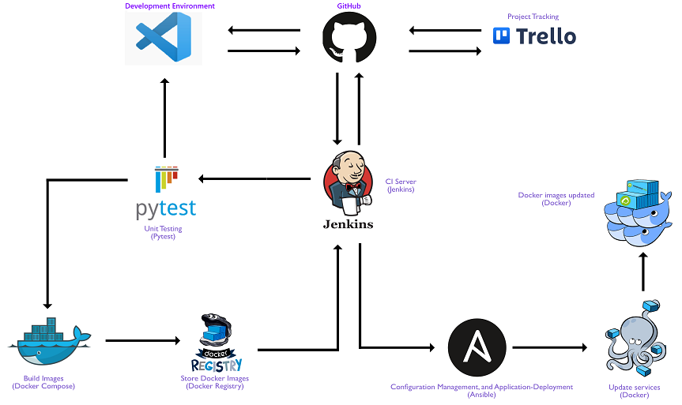

#### NGINX Interactions Diagram
The diagram below represents the structure of virtual machines used in this project, whereby a user would connect to the NGINX machine on port 80. NGINX acts as a load balancer and distributes work between the manager and worker virtual machines. NGINX adds a layer of security from users accessing the back-end of the application.

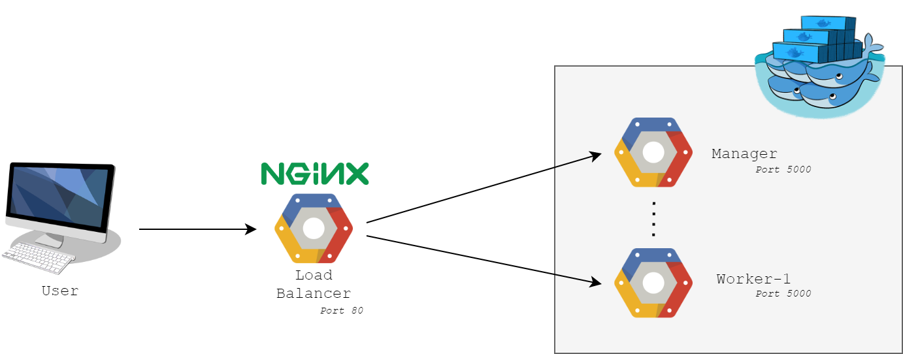

#### Ansible

Ansible is a configuration management tool. Also Ansible is agentless which allows it to spin up a large amount of nodes quickly. It can be used to configure the virtual machines used in the project to ensure that the VM is in the desired state.

#### Jenkins

Jenkins is a powerful tool, in this project it can be used to preform a rolling update ensuring that the service has no downtime. Below are the stages of my Jenkinsfile.

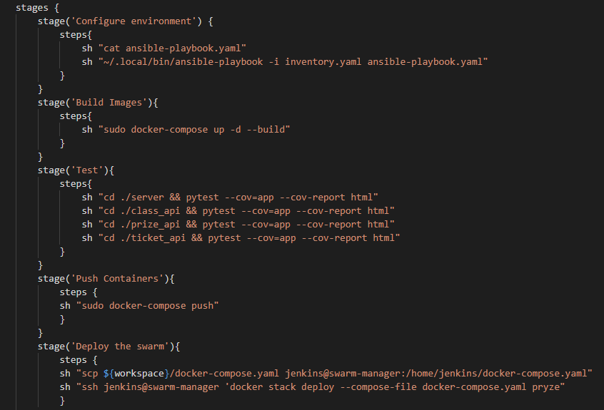

## __Development__

### __Front End__

Below is the front-end of my application.

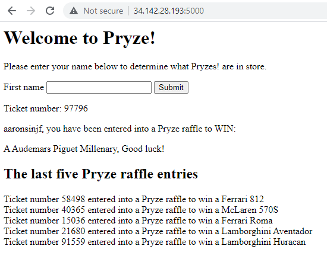

### __Testing__

Seen below are results for mock testing of the services:

Server
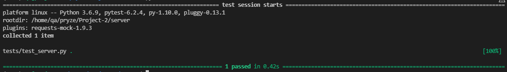

Ticket_API
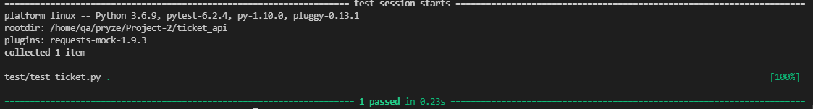

Class_API
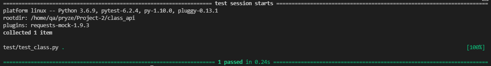

Prize_API
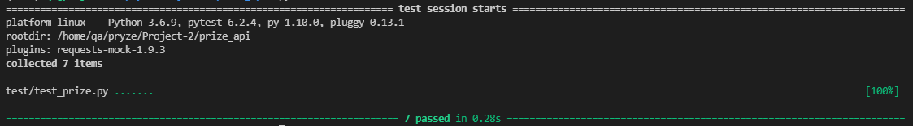
